# 🖥️ Linux Server Homelab

A personal homelab setup to learn basic Linux server administration using VirtualBox and Ubuntu Server 22.04.

---

## 📚 Table of Contents
1. [Project Overview](#project-overview)  
2. [Objectives](#objectives)  
3. [Tools Used](#tools-used)  
4. [Setup Steps](#setup-steps)  
5. [What You Learned](#what-you-learned)  
6. [Resources](#resources)  
7. [Future Improvements](#future-improvements)  
8. [Screenshots](#screenshots)

---

## 📌 Project Overview

This project documents my hands-on journey in setting up a Linux server homelab using VirtualBox and Ubuntu Server. It includes creating users, configuring SSH, installing Apache, and securing the system with UFW.

---

## 🎯 Objectives

- Install Ubuntu Server in a virtual machine  
- Create and manage users and groups  
- Configure SSH for remote access  
- Set up a basic web server with Apache  
- Secure the server using UFW firewall  

---

## 🛠 Tools Used

- VirtualBox  
- Ubuntu Server 22.04 LTS  
- Terminal / SSH (PuTTY or native)  
- Apache2  
- UFW (Uncomplicated Firewall)  

---

## 🔧 Setup Steps

### 1. Install Ubuntu Server in VirtualBox

- Download Ubuntu Server ISO  
- Create a new VM (2 GB RAM, 20 GB disk)  
- Install Ubuntu with default settings  

📸 VM Setup  
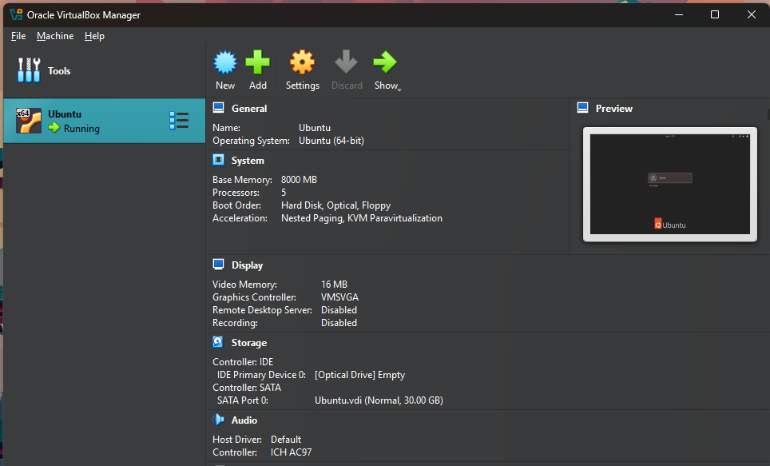  
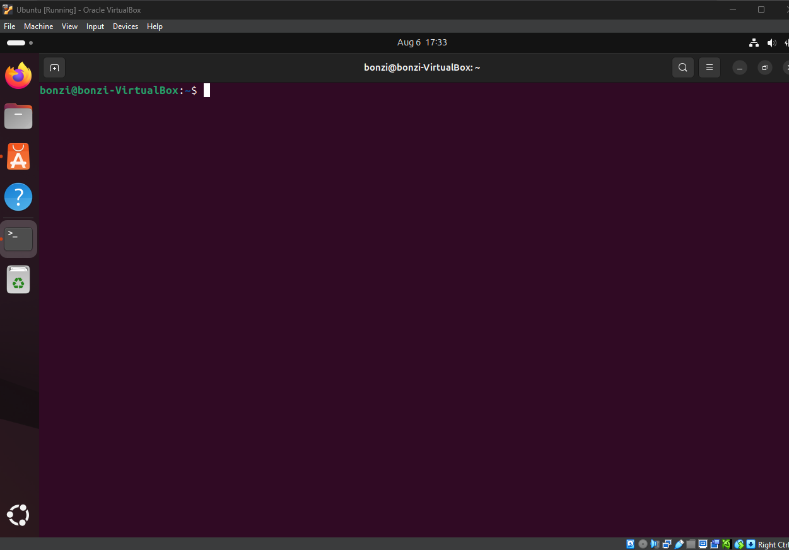

---

### 2. Update & Upgrade Packages

```bash
sudo apt update && sudo apt upgrade -y
```

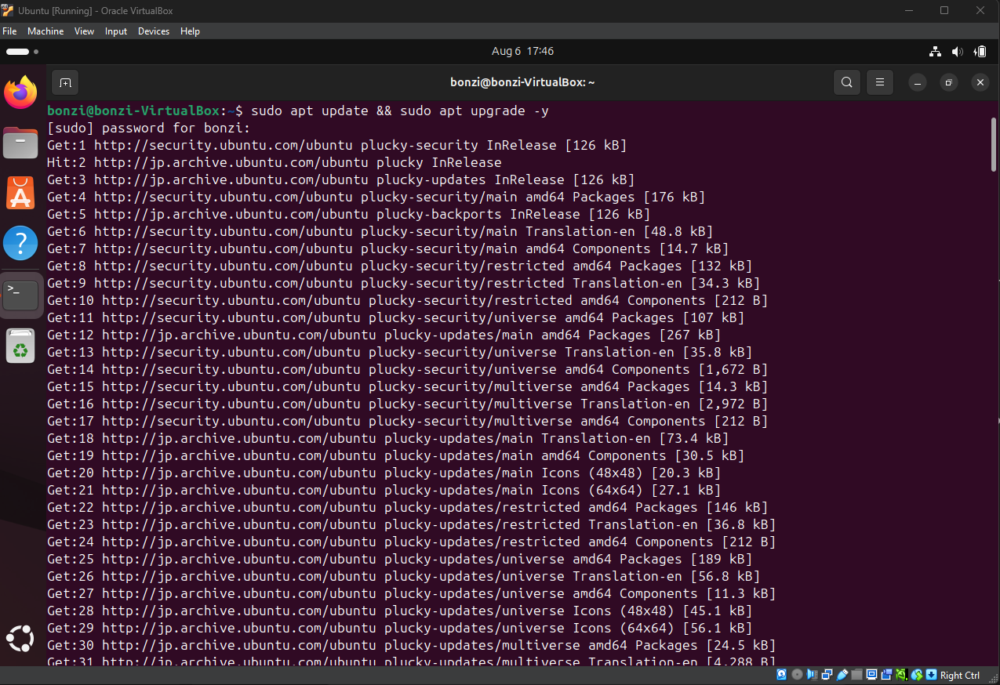

---

### 3. Add New User and Group

```bash
sudo adduser testuser  
sudo groupadd devgroup  
sudo usermod -aG devgroup testuser  
id testuser
```

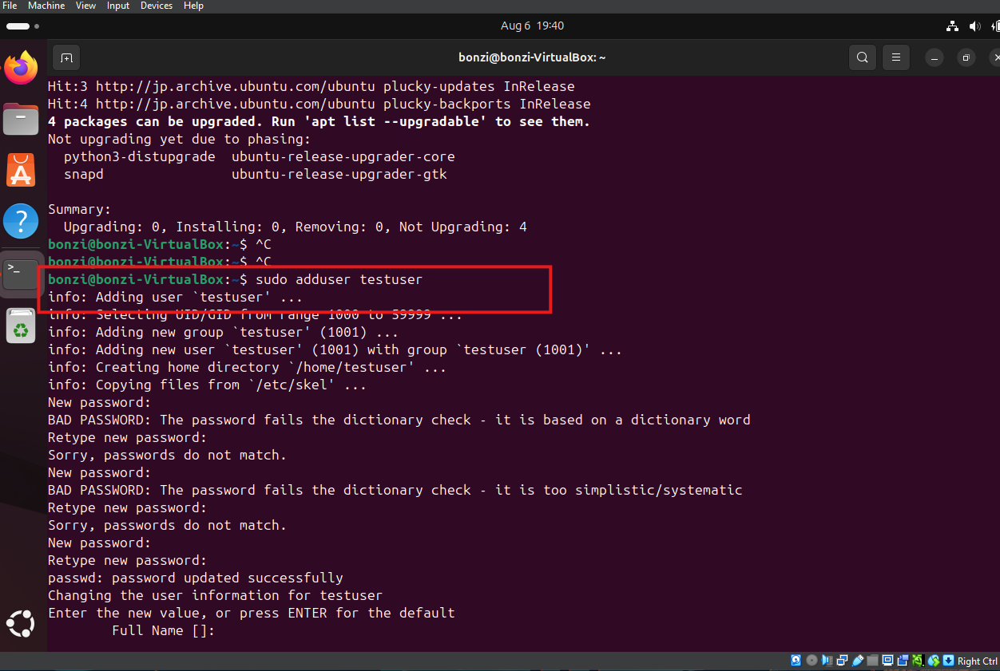  
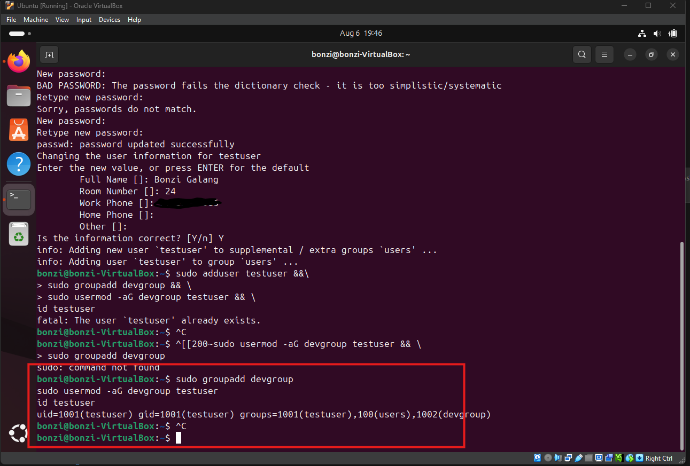

---

### 4. Configure SSH

```bash
sudo apt install ssh  
sudo systemctl enable ssh  
sudo systemctl start ssh  
sudo nano /etc/ssh/sshd_config
```

Update the config:

```conf
PermitRootLogin no  
PasswordAuthentication yes
```

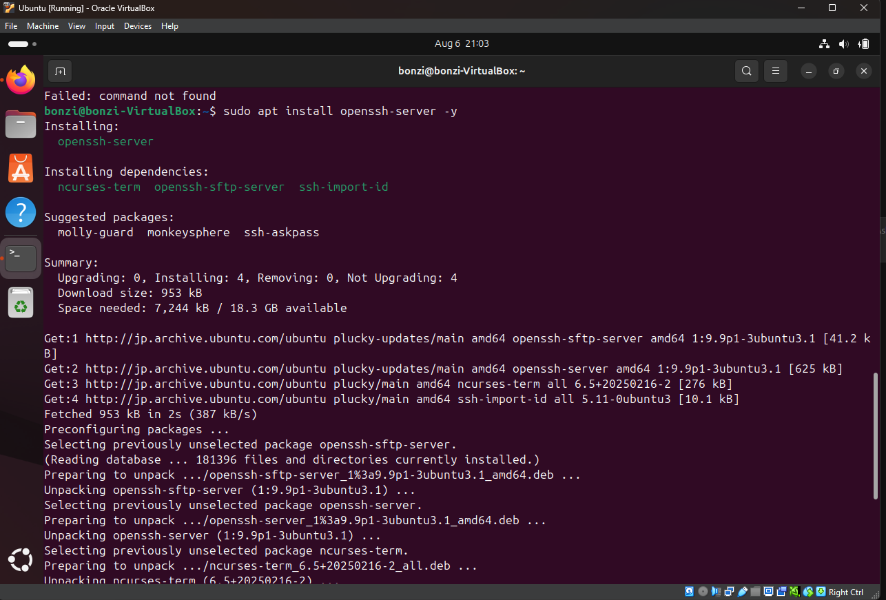  
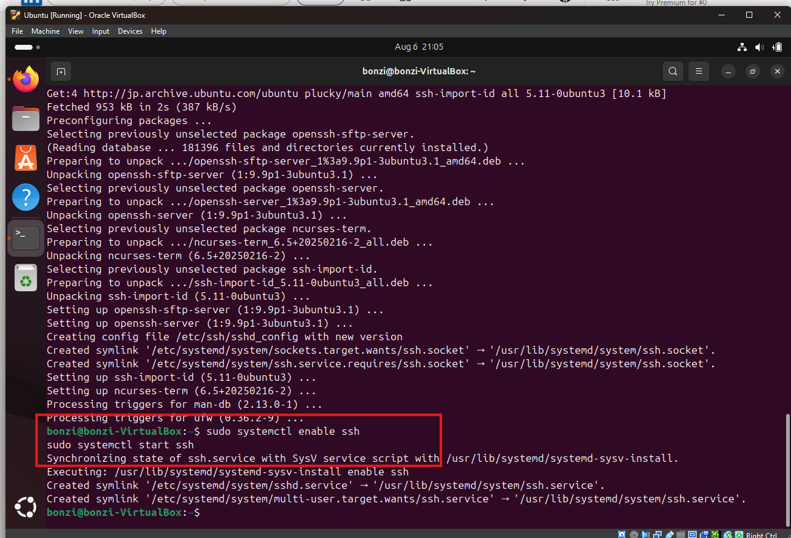  
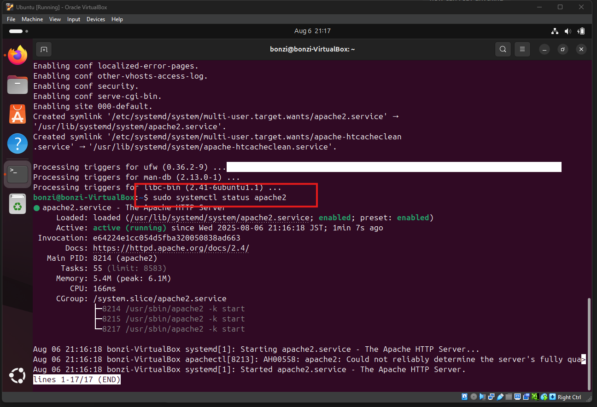  
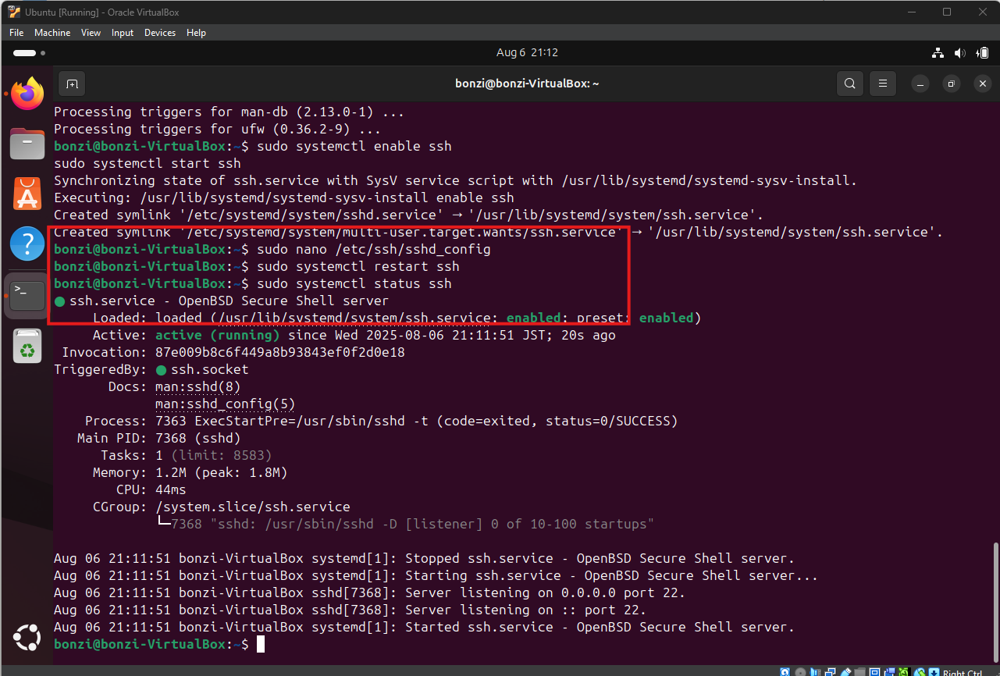

---

### 5. Set Up Apache Web Server

```bash
sudo apt install apache2
```

Find the VM's IP address:

```bash
ip a
```

Open a browser and go to:  
`http://<your-vm-ip>`

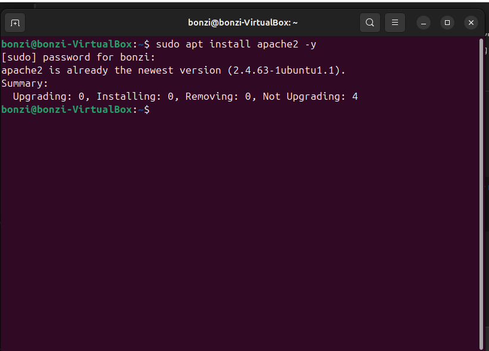  
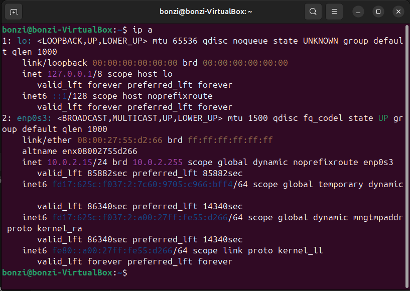

---

### 6. Configure UFW Firewall

```bash
sudo ufw allow OpenSSH  
sudo ufw allow 'Apache Full'  
sudo ufw enable  
sudo ufw status
```

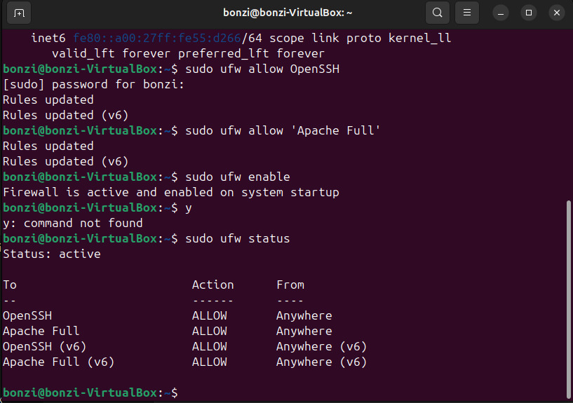  
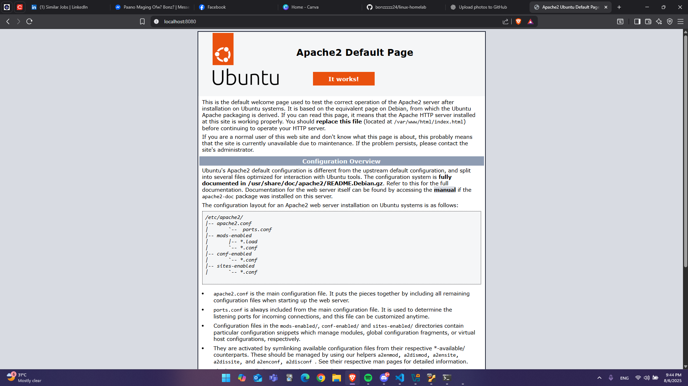

---

## ✅ What You Learned

- How to install and configure a Linux server in a VM  
- User and group administration  
- Secure remote access with SSH  
- Basic web hosting using Apache  
- Applying firewall rules using UFW  

---

## 🔗 Resources

- Ubuntu Server ISO  
- Apache Documentation  
- UFW Guide  

---

## 🚀 Future Improvements

- Add cron jobs for automation  
- Enable and secure SFTP access  
- Monitor server performance using tools like `htop`, `glances`, or `vnstat`  
- Schedule automatic security updates  
- Set up Fail2Ban for brute force protection  

---

## 📸 Screenshots

Images used above are stored in the `/screenshots` folder and used to visualize important steps in the homelab setup.
